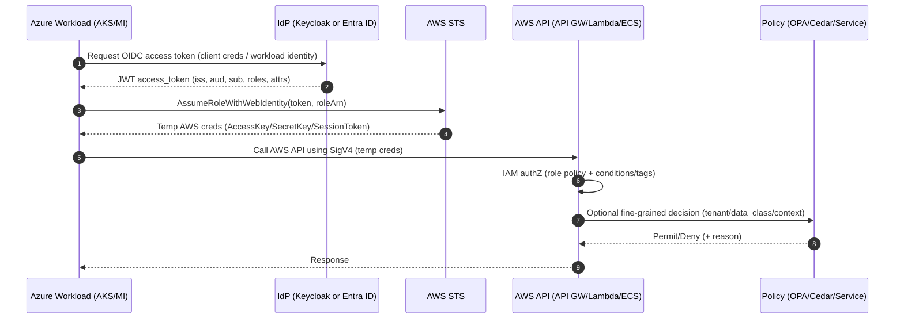
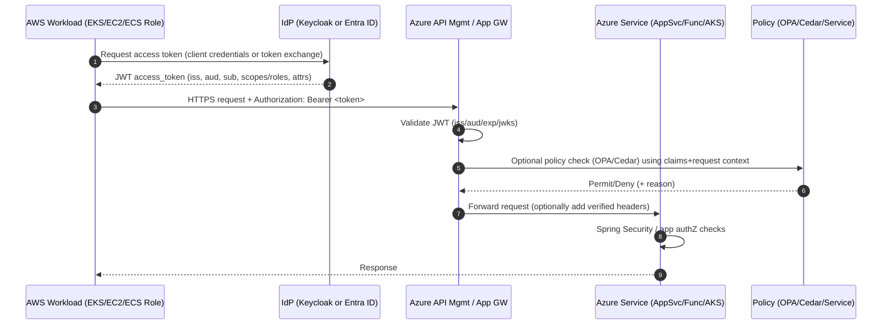

Below is a practical “how it actually works” blueprint for **federated, cross-cloud authentication + authorization** where **Azure services call AWS services (and vice-versa)** using **OIDC/OAuth2**, with **RBAC / ABAC / CBAC** enforced consistently—using **Keycloak** *and/or* native identity services (**Microsoft Entra ID / Azure AD**, **AWS IAM Identity Center / Cognito / IAM**).

---

## Target architecture (high level)

**Two planes:**

1. **Identity plane (who are you?)**

   * External Identity Provider(s): **Microsoft Entra ID**, **Keycloak**, **AWS Cognito** (optional)
   * Federation protocols: **OIDC**, **SAML** (legacy), **OAuth2**
   * Token types: **JWT access tokens**, **ID tokens**, sometimes **SAML assertions**

2. **Access plane (what can you do?)**

   * Policy enforcement: API Gateway/WAF + Envoy/sidecar + application
   * Policy decision: **OPA**, **AWS Verified Permissions (Cedar)**, **Keycloak Authorization Services**, or app-level policy
   * Cloud-native authorization: **AWS IAM policies**, **Azure RBAC**, **Azure API Management policies**

---

## The cleanest cross-cloud pattern: “Token in, token out” (federation + token exchange)

### Flow A: Azure workload → AWS service (OIDC federation)

**Goal:** Azure service gets an OIDC token from a trusted IdP, then obtains AWS credentials and calls AWS APIs.

* **Azure workload identity**

  * Use **Managed Identity** (VM/AKS/Functions/App Service) or **AKS Workload Identity**
  * Acquire an **OIDC token** (issuer = Entra ID or a Keycloak realm)

* **AWS trust**

  * Create an **AWS IAM role** with a **trust policy** that accepts tokens from that OIDC issuer (Entra ID or Keycloak)
  * The Azure workload calls **AWS STS AssumeRoleWithWebIdentity**
  * AWS returns **temporary credentials** (or you call AWS service directly with SigV4 via temp creds)

* **Authorization**

  * AWS IAM policy attached to the role enforces **least privilege** (RBAC/ABAC in AWS terms)

✅ This is the canonical “workload identity federation” approach: **no long-lived secrets**.

---

### Flow B: AWS workload → Azure service (federation to Entra / APIM)

**Goal:** AWS service calls Azure API protected by Entra ID / APIM using OAuth2 client credentials or federated identity.

* **AWS workload identity**

  * Use IAM role (EC2/ECS/EKS) and **mint an identity token** via your IdP
  * Common options:

    * Use **Keycloak** as the OIDC issuer for workloads (recommended for portability)
    * Or use Entra’s app registration + certificate/secret (works, but secret mgmt is required unless you build federation)

* **Azure side**

  * Protect API with **Azure API Management** or **App Service Authentication**
  * Validate JWT issuer/audience/signature (JWKS)
  * Enforce roles/scopes/policies

---

## Where Keycloak fits (and why you’d use it)

Keycloak is useful when you want **one consistent auth layer** across clouds:

* **Broker / federation hub**

  * Keycloak can **federate users** from **Entra ID** (OIDC/SAML) and issue your “platform tokens”
* **Service accounts for workloads**

  * Keycloak can issue **client credentials tokens** for microservices
* **Token exchange**

  * Keycloak supports **OAuth2 Token Exchange** (useful when you want to convert an Entra token → platform token)
* **Central claim mapping**

  * Map groups/roles/attributes into consistent JWT claims used in *both* Azure and AWS policies

Think of it as: **Entra is the enterprise user directory**, **Keycloak is the multi-cloud policy/token router**.

---

## RBAC vs ABAC vs CBAC (how to apply them cross-cloud)

### RBAC (Role-Based Access Control)

**What it is:** Access is granted based on roles like `admin`, `billing-reader`, `order-writer`.

**Cross-cloud implementation**

* Put roles in tokens (JWT claims):

  * `roles: ["order:read", "order:write"]` or `realm_access.roles`
* Enforce at:

  * API Gateway / APIM policies
  * Keycloak authorization policies
  * App (Spring Security @PreAuthorize)

**Good for:** simple, auditable permissions.

---

### ABAC (Attribute-Based Access Control)

**What it is:** Decisions based on attributes:

* user attributes: `department=finance`, `region=us-east`
* resource attributes: `tenantId=123`, `dataClass=PHI`
* request attributes: `scope=read`, `clientId=svc-a`

**Cross-cloud implementation**

* Put attributes into JWT claims:

  * `tenant_id`, `org_id`, `dept`, `clearance`, `data_class`
* Enforce via policy engine:

  * **OPA** (Rego), **Cedar** (AWS Verified Permissions), or app logic
* AWS can also do ABAC with **IAM policy conditions** on principal/resource tags.

**Good for:** multi-tenant SaaS, data classification, fine-grained rules.

---

### CBAC (Context-Based Access Control)

**What it is:** Decisions based on *context*:

* time of day, device trust, IP ranges, risk score, MFA, geo, network zone, workload identity posture

**Cross-cloud implementation**

* Use conditional access / risk signals:

  * Entra Conditional Access can enforce MFA/device compliance for **user tokens**
* Put context hints in claims (careful—don’t trust client-supplied context):

  * `acr`, `amr`, `mfa=true`, `device_trust=managed`
* Enforce with gateway + policy engine:

  * Block calls not coming from expected network zones
  * Require `amr` includes `mfa` for privileged scopes
  * Require mTLS/SPFFE identity for east-west traffic

**Good for:** Zero Trust, privileged actions, sensitive data flows.

---

## Key terms & concepts (bullet list)

**OIDC / OAuth2**

* **Issuer (iss):** who minted the token
* **Audience (aud):** who the token is for (API identifier)
* **Scopes:** coarse permissions (`orders.read`)
* **Claims:** attributes inside JWT (`tenant_id`, `roles`, `groups`)
* **JWKS:** public keys endpoint to validate JWT signatures
* **Access token vs ID token:** access token for APIs; ID token for user session info
* **Token Exchange:** swapping one token for another trusted by a different domain
* **Client Credentials:** service-to-service OAuth flow

**Service-to-service security**

* **Workload Identity Federation:** no secrets, cloud workload proves identity via OIDC
* **mTLS / service mesh:** cryptographic service identity + encrypted east-west traffic
* **SPIFFE/SPIRE:** standard service identities (optional but strong)

**Authorization**

* **PEP/PDP:** Policy Enforcement Point (gateway/app) vs Policy Decision Point (OPA/Verified Permissions)
* **Least privilege:** minimal scopes/permissions; short token TTLs
* **Separation of duties:** admin actions require stronger context (CBAC)

---

## How to enforce this with Java APIs (Spring Boot pattern)

**Typical Java enforcement points:**

* **Edge (recommended):** API Gateway / APIM validates JWT + basic authorization
* **Service:** Spring Security validates JWT and enforces role/attribute policies

### Spring Security essentials

* Configure app as an **OAuth2 Resource Server** (JWT validation)
* Validate:

  * `iss` matches your IdP (Keycloak or Entra)
  * `aud` matches your API
  * signature via JWKS
* Map claims → authorities:

  * `roles` or `scp` → `GrantedAuthority`
* Enforce:

  * RBAC: `@PreAuthorize("hasAuthority('SCOPE_orders.write')")`
  * ABAC/CBAC: `@PreAuthorize("@policy.canWrite(#tenantId, authentication)")`

### Recommended: central policy, not scattered `if` statements

* Put ABAC/CBAC rules in:

  * **OPA** sidecar (HTTP policy check) or
  * **AWS Verified Permissions** (Cedar) or
  * Keycloak Authorization Services (UMA2) if you’re all-in on Keycloak

---

## Cloud-native options besides Keycloak

### Azure (Microsoft Entra ID / Azure AD)

* **User auth:** OpenID Connect, OAuth2
* **Conditional Access:** strong CBAC for users (device, location, risk)
* **API protection:** APIM + App registrations + scopes/app roles
* **Workload identity:** Managed Identity / AKS Workload Identity

### AWS

* **IAM + STS:** strongest for workload authZ in AWS
* **Cognito:** user pools / OAuth front door (if you need AWS-managed user auth)
* **IAM Identity Center:** workforce SSO (often SAML/OIDC integrations)
* **Verified Permissions:** centralized authorization using Cedar (ABAC/RBAC-like)

---

## A concrete “reference design” you can implement

**Identity**

* Users authenticate with **Entra ID**.
* Keycloak brokers Entra login (optional) and issues platform tokens.

**Workloads**

* Azure workloads use **Managed Identity / AKS Workload Identity** to get OIDC tokens.
* AWS workloads use **IAM roles** (EKS IRSA / ECS task roles / EC2 roles).

**Cross-cloud calls**

* Azure→AWS: OIDC token → **STS AssumeRoleWithWebIdentity** → AWS calls
* AWS→Azure: Keycloak client credentials token (or Entra app token) → call APIM-protected API

**Authorization**

* RBAC: scopes/roles in tokens
* ABAC: tenant/data classification claims + resource tags
* CBAC: enforce CA/MFA for privileged user actions; enforce network zone + mTLS for service calls
* Central policies via OPA or Verified Permissions

---

## Guardrails (things that prevent cross-cloud auth from becoming a mess)

* Keep **one canonical issuer per token domain** (e.g., “platform tokens” are always from Keycloak)
* Always validate **issuer + audience + signature + expiry**
* Use **short TTLs** for access tokens; rotate keys; enable JWKS caching
* Prefer **federation** over secrets (workload identity > client secrets)
* Standardize claim names: `tenant_id`, `roles`, `data_class`, `amr`, `client_id`
* Log decisions: `subject`, `tenant`, `policy`, `decision`, `reason` (auditability)


Absolutely — here are **(1) sequence diagrams**, **(2) a practical Keycloak realm layout**, and **(3) example OPA (Rego) + Cedar policies** you can lift into a real build.

---

## 1) Sequence diagrams (Mermaid)

### A) Azure workload → AWS service (OIDC federation + STS)



### B) AWS workload → Azure API (token acquisition + APIM)



### C) User → Azure frontend → AWS backend (Token Exchange pattern)

```mermaid
sequenceDiagram
  autonumber
  participant U as User
  participant FE as Azure Frontend (SPA / WebApp)
  participant EN as Entra ID
  participant KC as Keycloak (Broker/Exchange)
  participant AWSAPI as AWS Backend API
  participant PDP as OPA/Cedar

  U->>FE: Use app
  FE->>EN: OIDC auth code flow (PKCE)
  EN-->>FE: id_token + access_token (Entra)

  FE->>KC: Token Exchange (Entra token -> platform token)
  KC-->>FE: platform access_token (Keycloak issuer; normalized claims)

  FE->>AWSAPI: Bearer platform token (or call STS flow via backend)
  AWSAPI->>PDP: Fine-grained policy decision
  PDP-->>AWSAPI: Permit/Deny
  AWSAPI-->>FE: Response
```

---

## 2) Keycloak realm layout (multi-cloud, portable)

### Realm: `platform`

**Purpose:** Normalize identities and claims across Azure + AWS, and mint “platform tokens” that every API trusts.

#### Identity Providers (federation)

* **Entra ID (Azure AD)** as an external IdP (OIDC)

  * Use it for **human users**
* Optional: **SAML** IdP (legacy workforce SSO)

#### Clients (OIDC)

1. `svc-orders` (confidential)

   * Service-to-service client for Orders API
   * Flow: **client_credentials**
   * Token audience: `orders-api`
2. `svc-billing` (confidential)

   * Flow: **client_credentials**
3. `web-portal` (public)

   * Flow: **auth code + PKCE**
4. `token-exchange-client` (confidential)

   * Has permission to do **token exchange** (if you use that pattern)

#### Client scopes (recommended)

* `tenant`

  * adds `tenant_id`, `org_id`
* `roles`

  * adds `roles` claim
* `data`

  * adds `data_class`, `regions`, `projects`
* `context`

  * adds `amr`, `acr` (MFA indicators), `device_trust` (if you trust upstream)

#### Roles (RBAC)

* Realm roles (coarse): `platform-admin`, `support`, `auditor`
* Client roles (fine, per API):

  * `orders:read`, `orders:write`, `orders:approve`
  * `billing:read`, `billing:write`

#### Groups (for easier admin)

* `tenant-123-admins`
* `tenant-123-users`
* `finance-dept`
* `region-us-east`

#### Mappers (claim normalization)

* Map Entra `groups` → `roles` or `groups`
* Map user attributes → `tenant_id`, `dept`, `clearance`
* Add standard claims:

  * `aud`: your API audience(s)
  * `azp`: authorized party (client_id)
  * `typ`: `Bearer`

#### Token settings (security)

* Access token TTL: **5–15 minutes**
* Refresh token TTL: depends on app (web-portal only)
* Rotate signing keys; publish JWKS
* Turn on **“Proof Key for Code Exchange”** for public clients

---

## 3) OPA policies (Rego) — RBAC + ABAC + CBAC

### A) Input shape (what your gateway/service sends to OPA)

This is a common pattern: you pass request + verified JWT claims.

```json
{
  "request": {
    "method": "POST",
    "path": "/tenants/123/orders",
    "ip": "10.2.3.4",
    "time_utc": "2026-01-29T14:00:00Z"
  },
  "token": {
    "sub": "user:abc",
    "client_id": "svc-orders",
    "tenant_id": "123",
    "roles": ["orders:write"],
    "scopes": ["orders.write"],
    "amr": ["mfa"],
    "data_class": "PHI"
  },
  "resource": {
    "tenant_id": "123",
    "data_class": "PHI"
  },
  "context": {
    "network_zone": "trusted",
    "risk": "low"
  }
}
```

### B) Rego policy

```rego
package authz

default allow := false
default reason := "denied_by_default"

# Helper sets
trusted_zones := {"trusted", "corp"}
sensitive_classes := {"PHI", "PCI"}

# ---- RBAC ----
has_role(role) {
  role == input.token.roles[_]
}

has_scope(scope) {
  scope == input.token.scopes[_]
}

# ---- ABAC ----
same_tenant {
  input.token.tenant_id == input.resource.tenant_id
}

# ---- CBAC ----
trusted_network {
  input.context.network_zone == trusted_zones[_]
}

mfa_present {
  "mfa" == input.token.amr[_]
}

# Policy: write orders requires role OR scope, same tenant, and if PHI then MFA + trusted zone
allow {
  input.request.method == "POST"
  startswith(input.request.path, "/tenants/")
  same_tenant

  # RBAC OR OAuth scope
  (has_role("orders:write") or has_scope("orders.write"))

  # CBAC for sensitive
  not sensitive_resource_requires_extra_controls
}

allow {
  input.request.method == "POST"
  same_tenant
  (has_role("orders:write") or has_scope("orders.write"))
  sensitive_resource_requires_extra_controls
  mfa_present
  trusted_network
}

sensitive_resource_requires_extra_controls {
  input.resource.data_class == sensitive_classes[_]
}

# Optional: return a reason
reason := r {
  allow
  r := "allowed"
} else := r {
  sensitive_resource_requires_extra_controls
  not mfa_present
  r := "mfa_required_for_sensitive_data"
} else := r {
  sensitive_resource_requires_extra_controls
  not trusted_network
  r := "trusted_network_required_for_sensitive_data"
} else := "missing_role_or_scope_or_tenant_mismatch"
```

**Where it runs:**

* At **APIM / API Gateway / Envoy** as a PEP (Policy Enforcement Point)
* Or inside Spring Boot (call OPA before sensitive actions)

---

## 4) Cedar policies (AWS Verified Permissions) — RBAC + ABAC + CBAC

Cedar is great when you want **central policy decisions** with a managed PDP.

### A) Model (Entities)

You typically define:

* `User` (or `Principal`) with attributes (tenant, roles, clearance)
* `Action` (`Orders::Create`, `Orders::Read`)
* `Order` (resource) with attributes (tenant, data_class)
* Optional `Context` passed at request time (network_zone, mfa, risk)

### B) Example Cedar policy set

#### 1) Base RBAC: allow `orders:write`

```cedar
permit(
  principal,
  action in [Orders::Create, Orders::Update],
  resource
)
when {
  "orders:write" in principal.roles
};
```

#### 2) ABAC: tenant isolation

```cedar
permit(
  principal,
  action in [Orders::Create, Orders::Update, Orders::Read],
  resource
)
when {
  principal.tenant_id == resource.tenant_id
};
```

> In practice, you usually combine RBAC + tenant check together to avoid accidentally permitting too much:

```cedar
permit(
  principal,
  action in [Orders::Create, Orders::Update],
  resource
)
when {
  principal.tenant_id == resource.tenant_id
  && ("orders:write" in principal.roles || "orders.write" in principal.scopes)
};
```

#### 3) CBAC: sensitive data requires MFA + trusted network

```cedar
permit(
  principal,
  action in [Orders::Create, Orders::Update],
  resource
)
when {
  principal.tenant_id == resource.tenant_id
  && ("orders:write" in principal.roles || "orders.write" in principal.scopes)
  && resource.data_class != "PHI"
};

permit(
  principal,
  action in [Orders::Create, Orders::Update],
  resource
)
when {
  principal.tenant_id == resource.tenant_id
  && ("orders:write" in principal.roles || "orders.write" in principal.scopes)
  && resource.data_class == "PHI"
  && context.mfa == true
  && context.network_zone == "trusted"
};
```

### C) Example entity shapes (conceptual)

* `principal.roles` from JWT `roles`
* `principal.scopes` from JWT `scp`/`scope`
* `principal.tenant_id` from JWT `tenant_id`
* `resource.tenant_id` from the request path or DB lookup
* `context.mfa` derived from JWT `amr`/`acr` **after validation**
* `context.network_zone` derived from gateway (IP ranges / private link / mTLS)

---

## 5) How to wire this into Java + gateways (minimal pattern)

### Gateway (recommended)

* Validate JWT (iss/aud/exp/signature)
* Derive `context` (network zone, client cert, risk)
* Call PDP:

  * **OPA**: REST check (fast, self-hosted)
  * **Verified Permissions**: API call (managed, strong governance)
* If Permit: forward request with **verified headers** (optional)

  * `x-verified-tenant`, `x-verified-sub`, `x-verified-roles`

### Spring Boot service

* Resource Server validates JWT again (defense in depth)
* Do coarse checks with Spring Security
* Do fine checks by calling PDP for sensitive operations

---

If you want, I can also provide:

* a **Keycloak realm JSON skeleton** (clients, roles, mappers),
* a **Spring Boot Security config** that maps Keycloak/Entra claims cleanly,
* and an **Envoy external authorization filter** example for OPA (common production approach).


```mermaid
sequenceDiagram
  autonumber
  participant U as User
  participant FE as Azure Frontend (SPA / WebApp)
  participant EN as Entra ID
  participant KC as Keycloak (Broker/Exchange)
  participant AWSAPI as AWS Backend API
  participant PDP as OPA/Cedar

  U->>FE: Use app
  FE->>EN: OIDC auth code flow (PKCE)
  EN-->>FE: id_token + access_token (Entra)

  FE->>KC: Token Exchange (Entra token -> platform token)
  KC-->>FE: platform access_token (Keycloak issuer; normalized claims)

  FE->>AWSAPI: Bearer platform token (or call STS flow via backend)
  AWSAPI->>PDP: Fine-grained policy decision
  PDP-->>AWSAPI: Permit/Deny
  AWSAPI-->>FE: Response
```